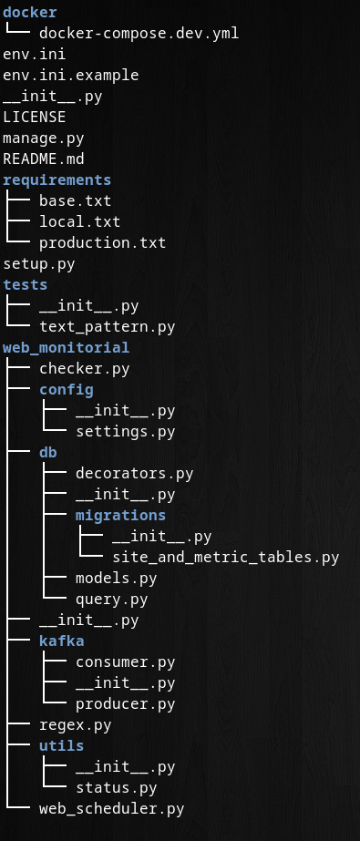

# web_monitorial


web monitorial is a web monitoring tool that can check response time pattern and etc

Features:

- request to a website and get status code
- analyze response time
- and look for a pattern if it's provided
- send the metrics to kafka
- Add metrics to postgresql

## Table of Content

1. [Overview](#overview)
    *   [Pros & Cons](#pros-and-cons)

2. [Prerequisites](#prerequisites)
    *   [Setup kafka and postgres via docker-compose](#setup-your-postgresql-and-kafka-instance-with-aiven-or-docker-compose)
    *   [Install requirments](#install-requirments)
    *   [Kafka and postgres Config](#kafka-and-postgres-config)
    *   [Sites Settings](#sites-settings)

3. [Usage](#usage)
    *   [Help](#help)
    *   [Test](#test)
    *   [Main Commands](#main-commands)



4. [Source Code](#src)

    *   [docker](#docker)
        *   [dockerfile](#dockerfile)
        *   [docker-compose-dev](#docker-compose-dev)
        *   [docker-compose](#docker-compose)
    *   [requirements](#requirements)
        *   [base](#base)
        *   [local](#local)
        *   [production](#production)
    *   [tests](#tests)
        *   [test_checker](#test_checker)
        *   [test_models](#test_models)
    *   [Manage.py](#manage)
    *   [Config](#config)
        *   [settings.py](#settings)
        *   [logging.conf](#log)
    *   [Kafka](#kafka)
        *   [init](#init)
        *   [Producer](#producer)
        *   [Consumer](#consumer)
    *   [DB](#db)
        *   [Migration](#migration)
        *   [Initial](#init)
        *   [Query](#query)
        *   [Models](#models)
    *   [checker](#checker)
    *   [schedule](#schedule)
    *   [utils](#utils)
        *   [decorators](#decorators)
            *   [exception_logger](#exception_logger)
            *   [db_connection](#db_connection)
            *   [timeout](#timeout)
        *   [regext](#regex)
        *   [status](#status)

## Overview

So you want to monitor your website without changeing your code? web_monitorial will help you with that
most of the monitoring tools like prometheus needs a change and adding plugin to your source code
but here we don't need any of that 

web monitorial will act as a client and request to your website 
with the interval you provided then calculate the response time availability and check if the certin pattern match or not
then push these metrics into you kafka cluster and then web_monitorial consumer will consume the data from kafka
and after some validation insert the data into the database

### Pros and Cons
#### Pros
- Easy to use
- Easy to config
- Good troubleshooting

#### Cons
- works only on linux
- lack of network checking

## prerequisites

### Setup your postgresql and kafka instance with aiven or docker-compose
```bash
cd docker
docker-compose -f docker-compose.dev.yml up -d
```

### install requirments
```bash
cd requirements
pip install -r requirments.txt
```
### kafka and postgres config
copy and chenge env.ini as you like
```
cp env.ini.example env.ini
```

### sites settings
go to settings.py
```
vim web_monitorial/config/settings.py
```

set website config as follows
```
URLS = [
        {"name":"Google", "url":"https://google.com", "interval":5, "pattern":"div"},
        {"name":"StackOverFlow","url":"https://stackoverflow.com/", "interval":10},
        {"name":"Aiven","url":"https://aiven.io/", "interval":10, "pattern":"salam"},
        ]
```

## Usage

### Help

Commands menu
```bash
python manage.py --help
```

Command detail
```bash
python manage.py command --help
```

### Test
run tests
```
python -m pytest
```
with logs
```
pytest . -rPs
```
### Main Commands
Crete postgres tables
```
python manage.py migrate
```
Spin off kafka consumer
```
python manage.py consume
```

Spin off kafka producer
```
python manage.py produce
```


## Source Code
in this section we gonna take a look at our source code
and some of modules to see how it works 

### docker
in this module we have docker related stuff
#### docker-compose-dev
docker-compose.dev.yml is a docker-compose file which can spin off postgres and kafka  
as well as UI for both of them:    
- localhost:5050 => pg admin
- localhost:8080 => kafka ui
### dockerfile
it's just gonna copy the file into docker container  
> **_NOTE:_** it's not gonna work here it should be in the root file next to the docker dir
### docker-compose
will build dockerfile and migrate the database for both producer and consumer
you can scale them as much as you like

TODO: This section is not working correctly i just put it as a proof of conecpt

### requirements
as you can see we have requirements.txt in our root directory  
which is calling requirements/ dir so here we have seprated requirements
#### base
base is the one that should always be installed no matter what
#### production
in case of useing some tool only for production for example sentry you can use this section
#### local
in case of having some requirements for only developer mode

### tests
test directory 
#### test_checker
we are using request.mock for mocking our requests
and testing different senarios
#### test_models
pydentic not only gonna change dic to class  
but also parses the values and validate them and some time change their types  
so we must make sure that it's working as we expected
### Manage
manage.py is our interface for working with web_monitorial package
it uses Typer for creating a robust cli application with good user interface

here is were the program begins so we initial our database connection and logger 
to be able to reuse them in the rest of the codes

By default typer provide a really good helper capability which can be used by --help in the command     
we used python doc string for each command for a better ux
### Config 
in this module we config our code
#### settings
in the settings.py we have some upper case variables which is used in the code

the config function is a function that read a ini file and return a dict base on the section

#### log

in logging.conf you can setup your own logging
the default behaviour is json formated logs 
with line number and function name and etc

### Kafka 
in this module we have kafka related codes for both consumer and producer
#### init
just like db in kafka init we have two function that can start and stop kafka connection
#### Producer
as the name suggest producer is function that start our kafka producer  
within the producer file there is produce_single which is a function that runs a single url checker  
in the produce function we compose all of it so we call single_producer with our scheduling system  
#### Consumer
consumer is gonna composer for kafka and postgresql

comsumer will consume from kafka then parse consumed data with pydantic
and use db module to persist is in the postgersql
### DB 
a module for database related codes
#### init
in the init we have get connection and stop the connection  
in the code we call these function only when we are running manage.py
#### migrations
here is our create table and drop table code  
in this directory there is a single migration file which is responsible for creating and deleting site and site_metric tables

we are installing some extention in order to be able to use gin index for site name which is a good index for full text searching  
there is another thing which might be confusing that why we are using float for timestamp
it's becuase that's the best practice for source of the truth time we can change it back to the time with timezone
when ever we want

#### query
so here we have a chain of functions which gonna call each other  
in each of them there is an sql which is using parametrised queries  
why we don't just use a simple string?[Here is why](https://www.btelligent.com/en/blog/best-practice-for-sql-statements-in-python-1/)

in the inset metric method we are getting an Metric model which is an pydantic object
for easier and more cleaner argument handeling

### models
in models.py we are useing pydantic for parsing kafka consumed data
so we can have some type checking and etc
to be ready for actual safe query

### checker 
in the checker.py we have the main bussines logic
it's gonna request to the url and generate some metrics

time.time => epoch time  
response_time => accurate latency calculated by requests lib

### schedule 
here is where it might get a little confusing
so as you know python schedule cannot run in a interval loop  
there is no settings for it so we create it by ourselves  
we are using a simple function which can take any args and it's gonna call it self

TODO: this is not the best approach because the task might take time and 
in this case interval is not accurate it's base on how much (task time + interval) took
### utils
in utils module we have our own utilities
so we have a bunch of tools that we can use across the codes
#### decorators
in this file we have some higher order function that are useing decorator pattern
##### db_connection 
we don't want to repeat ourselves(DRY) each time we are requesting something from the databasae
so i created a decorator which gonna use a reuseable connaction and create a cursor for each query
and at the end it gonna close it no matter what
##### exception_logger
as the name suggest it's an error handler that caches error and log it to the console and file
but here is the catch we don't want our exceptins goes silently so we are using log level
if level = error then we will break the program
if waring = just logging
##### timeout
here is why we cannot support window beasue in this decorator we are using alarm signal
during testing i realized that regex can take some times
so i needed something to handle this timeout
i had two choice  
1- use another process to watch another process 
2- use alarm signal
in the first approach the good thing is it's gonna work on winows as well
but i choose the secound one beacuse it's more robous
#### regex
the pattern finder gonna use re.search method to see 
it there is an match or not that's why we are using timeout
becuse search cannot handle timeout
#### status
a copied file from django rest framework library to check status codes
